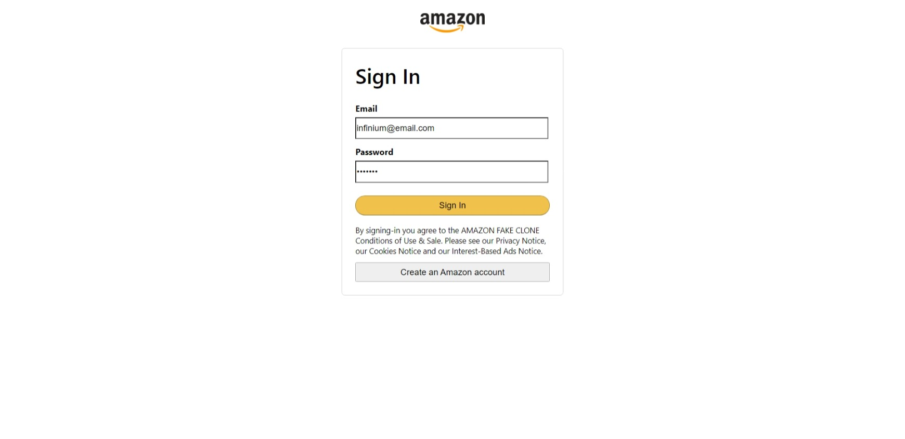

# Amazon Clone

Deployed on Firebase: [Amazon Clone](https://clone-cf8cb.web.app/)

## Web App Screenshots

 
  <kbd>
    
  </kbd>
 
 

  <kbd>
    
  </kbd>
  
  

  <kbd>
    
  </kbd>
  
  

  <kbd>
    
  </kbd>
  
  

  <kbd>
    
  </kbd>
  

## 💻 Tech Stack
1. ReactJS 
2. Firebase  
3. Stripe API 

